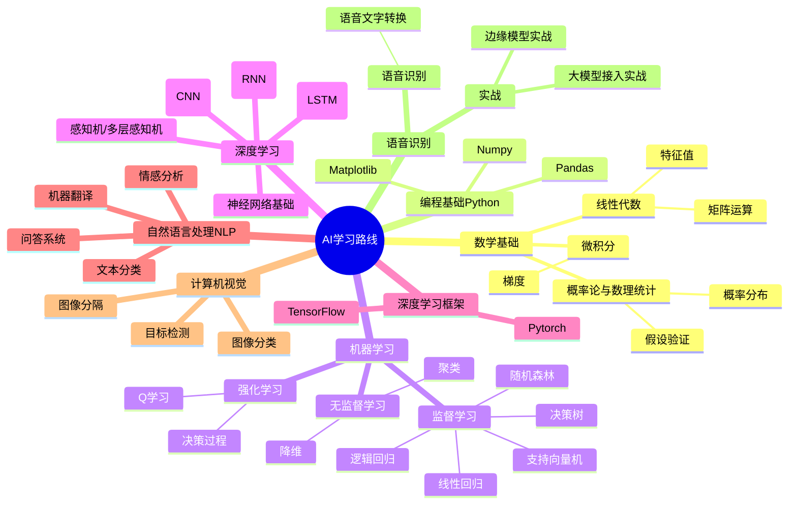

```mermaid
mindmap
  root((AI学习路线))
    数学基础
      线性代数
        矩阵运算
        特征值
      概率论与数理统计
        概率分布
        假设验证
      微积分
        梯度
    编程基础Python
      Numpy
      Pandas
      Matplotlib
   机器学习
     监督学习
       线性回归
       逻辑回归
       支持向量机
       决策树
       随机森林
     无监督学习
       聚类
       降维
     强化学习
       决策过程
       Q学习
   深度学习
     神经网络基础
     感知机/多层感知机
     卷积神经网络(CNN)
     循环神经网络(RNN)
     长短期记忆网络(LSTM)
   深度学习框架			
     TensorFlow
     Pytorch
   自然语言处理NLP
     文本分类   
     情感分析
     机器翻译
     问答系统
   计算机视觉
     图像分类
     目标检测
     图像分隔
   语音识别
     语音识别
      语音文字转换
    实战
      边缘模型实战
      大模型接入实战
	    
```
